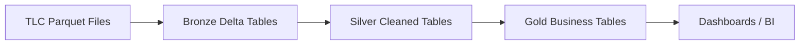

# NYC Taxi Databricks Pipeline

End-to-end **PySpark + Delta Lake** pipeline on NYC TLC trip data, built entirely inside Databricks.

## Overview

- **Ingestion:** Raw TLC parquet files uploaded to a Databricks Volume, loaded as Bronze Delta tables
- **Transformation:** PySpark DataFrames shaping Bronze → Silver → Gold
- **Storage:** Delta Lake (native to Databricks)
- **Orchestration:** Databricks Workflows (native scheduler)
- **Governance:** Unity Catalog

## Architecture

## Tech Stack

- **Databricks** — Lakehouse platform
- **PySpark** — distributed data processing
- **Delta Lake** — ACID storage layer
- **Databricks Workflows** — orchestration
- **Unity Catalog** — governance and lineage

## Dataset

NYC TLC Trip Record Data — [source](https://www.nyc.gov/site/tlc/about/tlc-trip-record-data.page)

## Status

🚧 Project in progress — Bronze ingestion phase