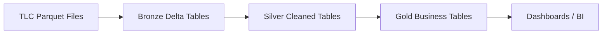

# NYC Taxi Databricks Pipeline

End-to-end **PySpark + Delta Lake** pipeline on NYC TLC trip data, built entirely inside Databricks.

## Overview

- **Ingestion:** Raw TLC parquet files uploaded to a Databricks Volume, loaded as Bronze Delta tables
- **Transformation:** PySpark DataFrames shaping Bronze → Silver → Gold
- **Storage:** Delta Lake (native to Databricks)
- **Orchestration:** Databricks Workflows (native scheduler)
- **Governance:** Unity Catalog

## Architecture

## Tech Stack

- **Databricks** — Lakehouse platform
- **PySpark** — distributed data processing
- **Delta Lake** — ACID storage layer
- **Databricks Workflows** — orchestration
- **Unity Catalog** — governance and lineage

## Dataset

NYC TLC Trip Record Data — [source](https://www.nyc.gov/site/tlc/about/tlc-trip-record-data.page)

## Status

🚧 Project in progress — Silver layer (audit complete)

### Completed
- ✅ Databricks catalog, schemas (`bronze`/`silver`/`gold`), and Volume created
- ✅ 3 months of NYC TLC Yellow Taxi data (April–June 2025) uploaded to Volume
- ✅ Bronze Delta table `nyc_taxi.bronze.raw_trips` created (12,885,358 rows, 19 columns)
- ✅ Data quality audit — see [`docs/DATA_QUALITY_AUDIT.md`](./docs/DATA_QUALITY_AUDIT.md)
- ✅ Audit notebook: `notebooks/02_silver_audit.ipynb`

### Next Steps
- 🔜 Silver layer — cleaning, deduplication, type casting, derived columns
- 🔜 Gold layer — business aggregates for reporting
- 🔜 Databricks Workflows — schedule the pipeline to run daily

## 📈 Results

**Bronze ingestion — 12.88M rows loaded into a Delta table:**

**Data quality audit — unexpected dates outside the target range:**

**Data quality audit — invalid records found (1.66M rows affected):**

