# NYC Taxi Databricks Pipeline

End-to-end **PySpark + Delta Lake** pipeline on NYC TLC trip data, built entirely inside Databricks.

## Overview

- **Ingestion:** Raw TLC parquet files uploaded to a Databricks Volume, loaded as Bronze Delta tables
- **Transformation:** PySpark DataFrames shaping Bronze → Silver → Gold
- **Storage:** Delta Lake (native to Databricks)
- **Orchestration:** Databricks Workflows (native scheduler)
- **Governance:** Unity Catalog

## Architecture

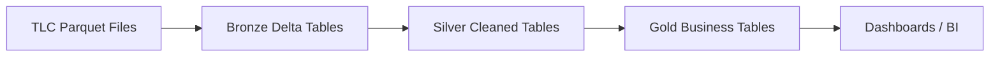

## Tech Stack

- **Databricks** — Lakehouse platform
- **PySpark** — distributed data processing
- **Delta Lake** — ACID storage layer
- **Databricks Workflows** — orchestration
- **Unity Catalog** — governance and lineage

## Dataset

NYC TLC Trip Record Data — [source](https://www.nyc.gov/site/tlc/about/tlc-trip-record-data.page)

## Status

🚧 Project in progress — Orchestration phase complete

### Completed
- ✅ Databricks catalog, schemas (`bronze`/`silver`/`gold`), and Volume created
- ✅ 3 months of NYC TLC Yellow Taxi data (April–June 2025) uploaded to Volume
- ✅ Bronze Delta table `nyc_taxi.bronze.raw_trips` created (12,885,358 rows, 19 columns)
- ✅ Data quality audit — see [`docs/DATA_QUALITY_AUDIT.md`](./docs/DATA_QUALITY_AUDIT.md)
- ✅ Audit notebook: `notebooks/02_silver_audit.ipynb`
- ✅ Silver Delta table `nyc_taxi.silver.trips_clean` created (11,634,221 rows after cleaning and deduplication)
- ✅ Silver validation — all impossible-record checks pass (0 invalid rows)
- ✅ Derived columns added: `trip_duration_minutes`, `tip_percentage`, `pickup_hour`, `pickup_day_of_week`, `has_valid_passenger_count`
- ✅ Gold layer — 4 tables:
  - `gold.dim_date` — Kimball date dimension (91 rows)
  - `gold.daily_summary` — daily trips + revenue aggregates (91 rows)
  - `gold.hourly_demand` — demand by day-of-week × hour (168 rows)
  - `gold.zone_performance` — trips + revenue by pickup zone, joined with zone lookup (261 rows)
- ✅ Gold validation — row counts, schema, cross-table consistency, and business rules all pass
- ✅ Databricks Workflows Job `nyc_taxi_pipeline` created — 5 tasks, daily 02:00 AM IST schedule
- ✅ Failure handling verified — retry policy, dependency blocking, and email alerting all working

### Next Steps
- 🔜 Dashboard / BI — visualize the Gold tables

## 📝 Known Observations

- **`daily_summary` column order** — `pickup_date` precedes `date_key` (natural key first for readability). This is intentional and differs from the `.select()` order used in `dim_date`.
- **Zone lookup coverage** — some pickup zones in the TLC data are not present in the official `taxi_zone_lookup.csv`. These are coalesced to `"Unknown"` rather than dropped, preserving trip counts.
- **`VendorID = 2` duplicates** — a small number of duplicate rows were detected in the Silver audit and removed via `row_number()` deduplication.

## 🔄 Orchestration — Databricks Workflows

The pipeline is scheduled as a Databricks Job (`nyc_taxi_pipeline`) that runs daily at 02:00 AM IST.

**Job structure — 5 tasks in a linear dependency chain:**

| Task | Notebook | Depends on |
|---|---|---|
| `bronze_ingestion` | `01_bronze_ingestion` | — |
| `silver_transformation` | `03_silver_transformation` | bronze_ingestion |
| `silver_validation` | `04_silver_validation` | silver_transformation |
| `gold_transformation` | `05_gold_transformation` | silver_validation |
| `gold_validation` | `06_gold_validation` | gold_transformation |

**Job configuration:**
- **Schedule:** Daily at 02:00 AM (UTC+05:30 Asia/Calcutta) — cron `0 0 2 * * ?`
- **Compute:** Serverless (per task)
- **Retry policy:** 1 retry, 5-minute delay, auto-optimization disabled
- **Notifications:** Email on failure only

**Demonstrated behaviors:**

- ✅ **Happy path** — full pipeline runs in ~2m 20s, all tasks green
- ✅ **Retry on failure** — failed tasks retry once after a 5-minute delay
- ✅ **Dependency chain** — downstream tasks are blocked when upstream fails
- ✅ **Failure alerting** — email sent within seconds of final failure
- ✅ **Recovery** — a fix and re-run restores the pipeline

See the [Results](#-results) section for screenshots.

## 📈 Results

**Bronze ingestion — 12.88M rows loaded into a Delta table:**

**Data quality audit — anomalies found:**

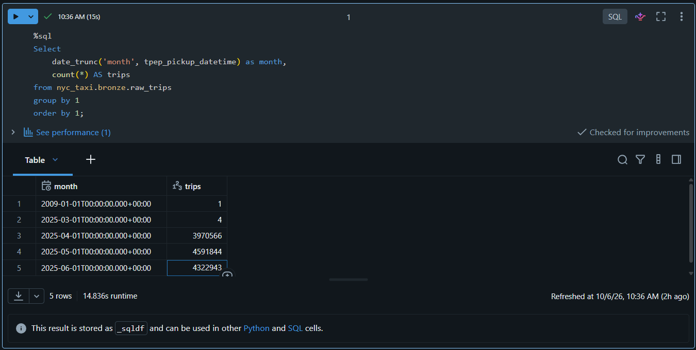
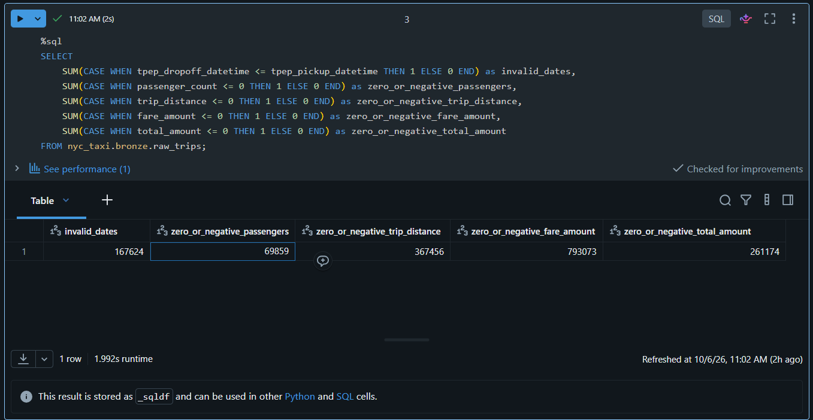

**Silver validation — impossible records removed (all checks pass):**

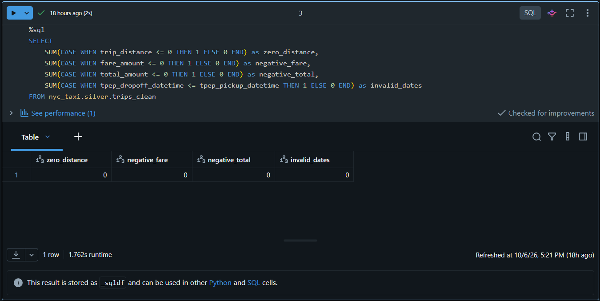

**Silver validation — duplicate check returns 0:**

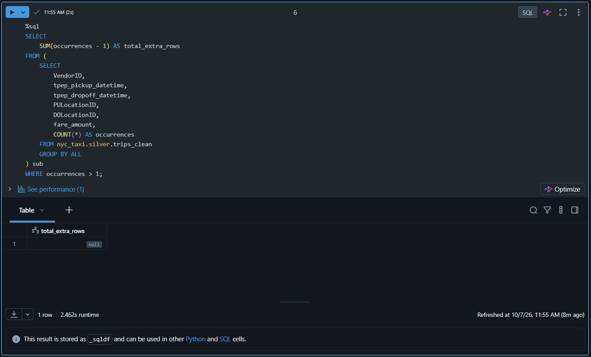

> 📓 Full validation notebook: [`notebooks/04_silver_validation.ipynb`](./notebooks/04_silver_validation.ipynb)

**Gold layer — all 4 tables built and verified:**
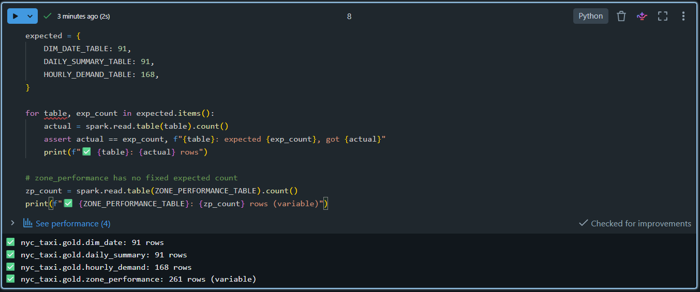

**Gold validation — cross-table consistency (11,634,221 = 11,634,221):**

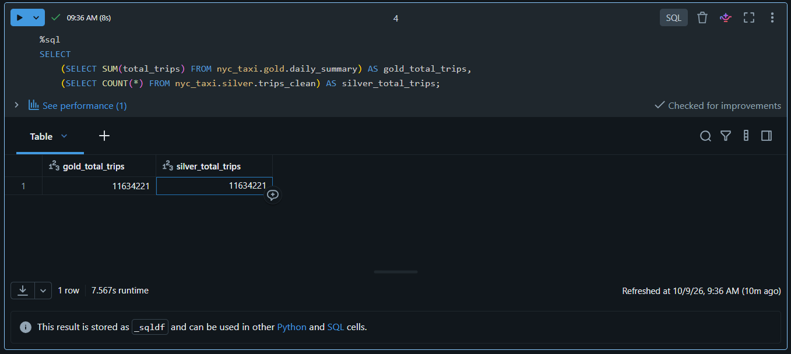

**Gold validation — business rules all pass (0 violations):**

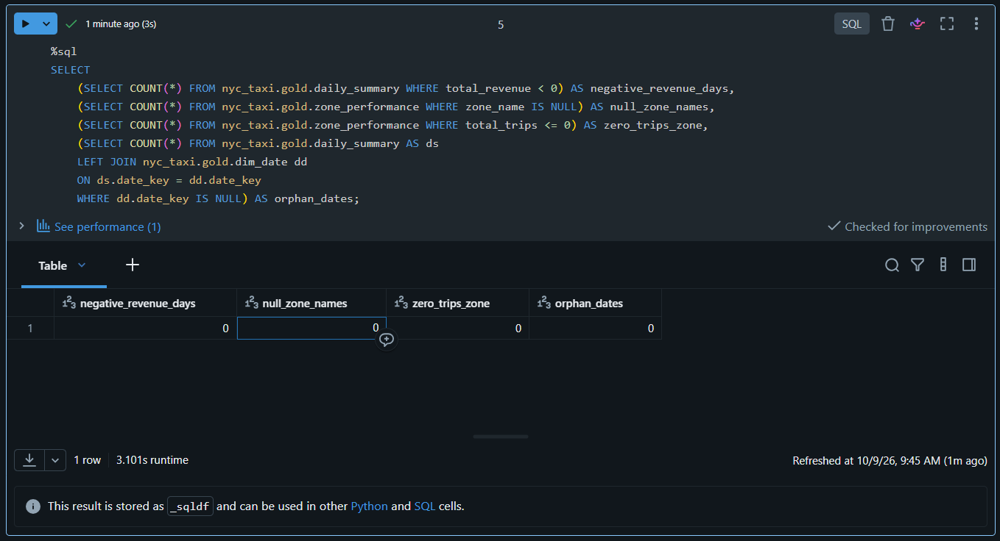

**Workflow — successful run (all 5 tasks green):**

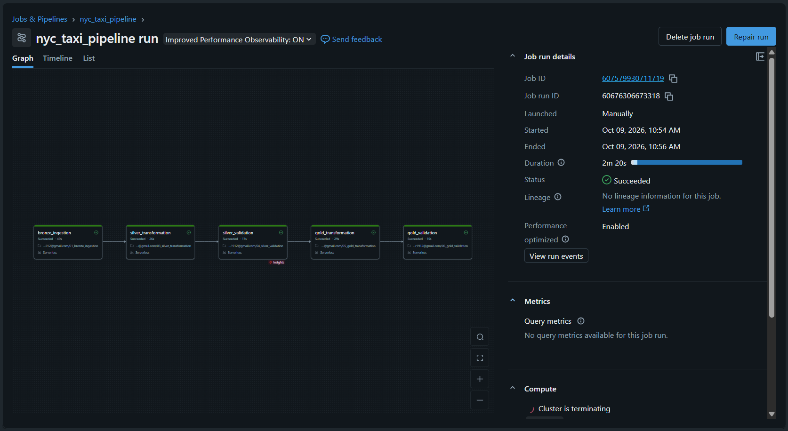

**Workflow — task timeline (durations per task):**

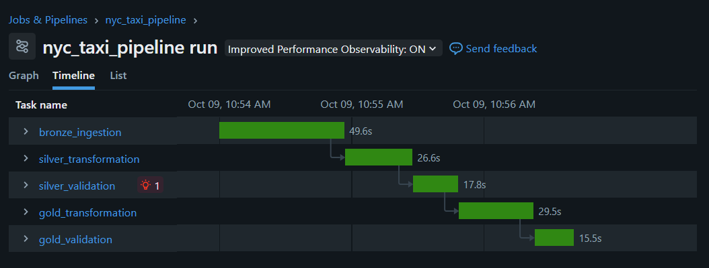

**Workflow — retry in progress (waiting for 2nd attempt):**

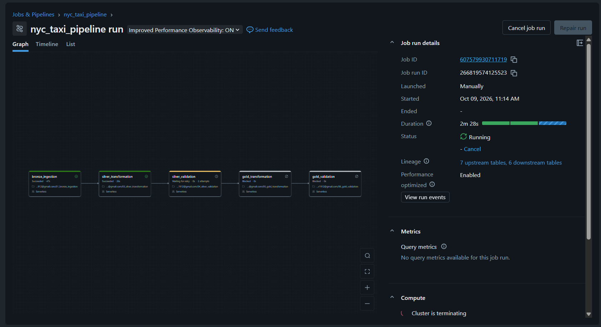

**Workflow — failure with downstream tasks blocked:**

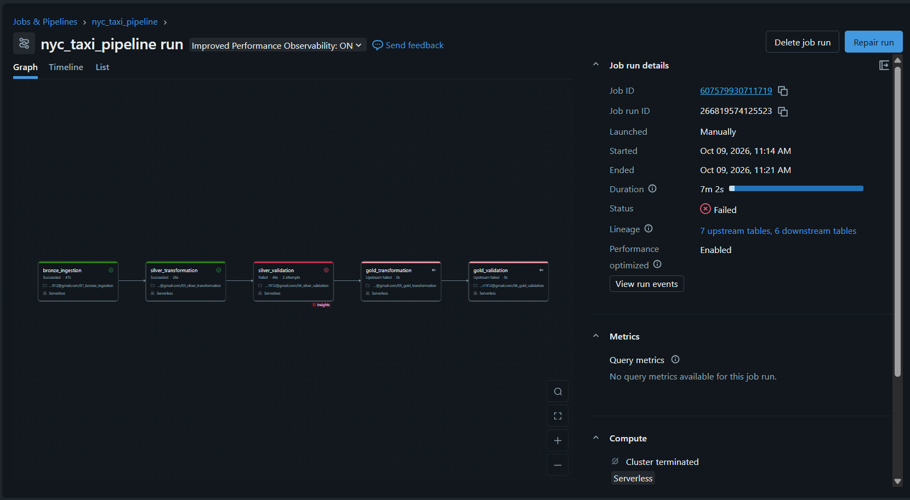

**Workflow — failure alert email:**

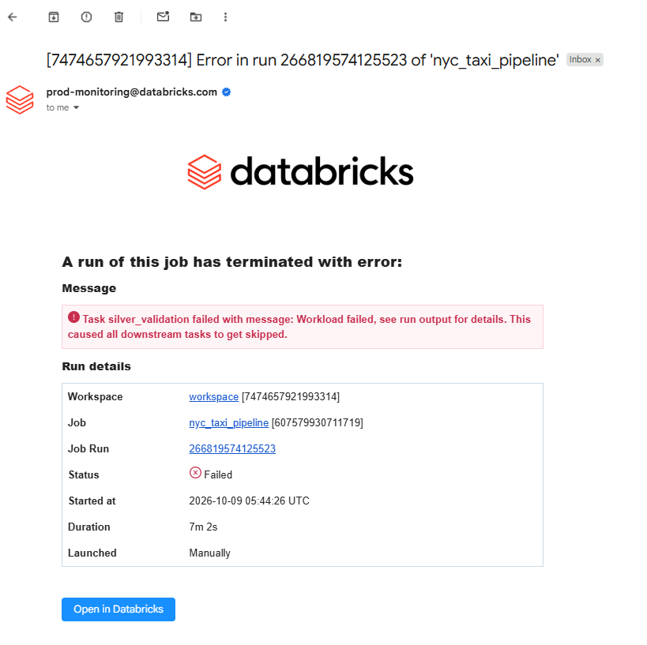

**Workflow — run history (success → failure → recovery):**

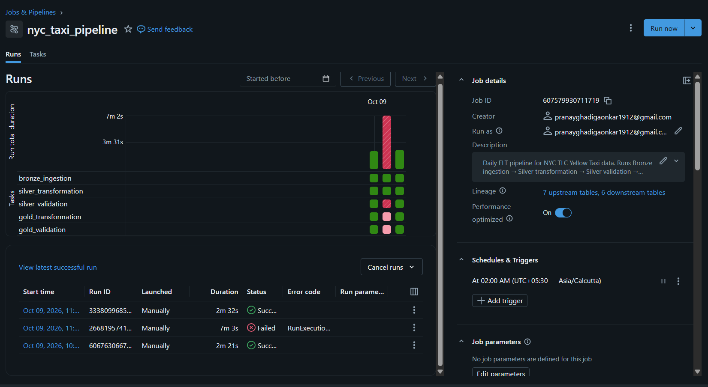

